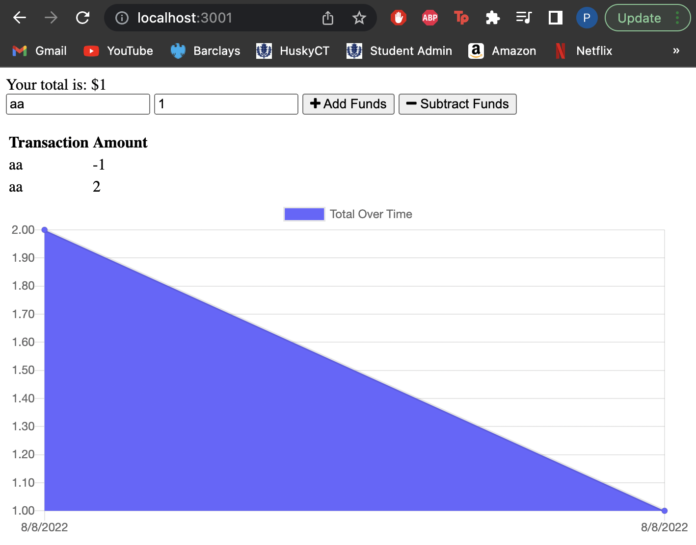

## PWA Budget Tracker
Created a way for users to track their money in a easy, efficient way. Also give them the ability to access the information at any time.

## Acceptance Criteria
- The user is able to track their withdrawals and deposits
- Have a working budget tracker even without internet connection
- User will receive a notification that they added a deposit or expense
- Deposit/expense is added into their transaction history and their total is updated

## Assets
The following shows what the website should look like:

